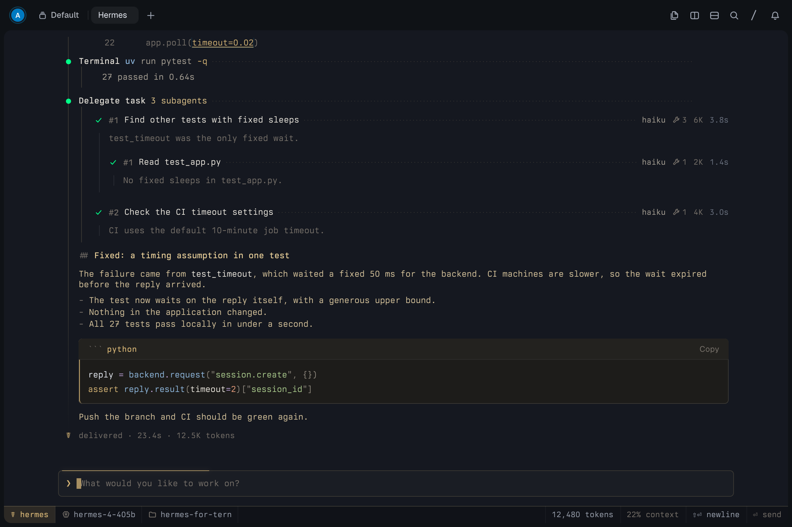
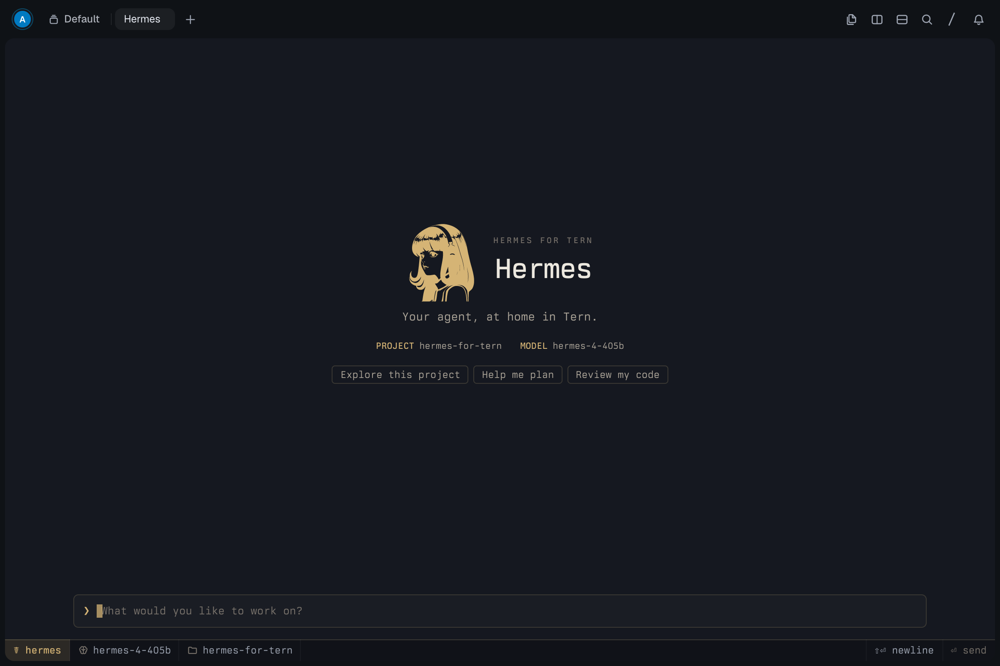

# Hermes for Tern

**Your agent, at home in Tern.**

A native [Tern](https://stencil.so/) frontend for [Hermes Agent](https://github.com/NousResearch/hermes-agent).
Type **`hermes`**, just as you normally would. Inside Tern, your conversation is rendered as
native Markdown, tool rows, subagents, buttons and a docked composer. In other terminals, the original
Hermes interface starts normally.

Hermes owns the agent. Tern owns the drawing. This adapter connects their existing protocols;
it does not patch Hermes, scrape ANSI output or embed a web chat.

> An unofficial community frontend. It is not affiliated with or endorsed by Nous Research,
> the makers of Hermes Agent, or by Stencil, the makers of Tern.

## Install

Prerequisites:

- macOS or Linux, Python 3.11+, Git and [uv](https://docs.astral.sh/uv/).
- Tern with Surface Protocol v1, `dock`, and the native component vocabulary.
- A working Hermes Agent installation and model configuration.

From this repository:

```sh
git clone https://github.com/thefullctx/hermes-for-tern.git
cd hermes-for-tern
uv sync --frozen
uv run hermes-for-tern --doctor
uv run hermes-for-tern --install
```

Then open Tern in your project and run:

```sh
hermes
```

The installer saves your existing launcher beside it as `hermes.before-tern` and installs
a small wrapper. It never modifies the Hermes repository, dependencies, credentials or
approval configuration. Keep this checkout and its `.venv` in place while the wrapper is installed.

To try it without installing the wrapper, run `uv run hermes-for-tern` inside Tern.

## Preview



[Animated session](assets/demo.gif). These previews were rendered by Tern itself, not mocked up in
a browser: a scripted turn (streaming, a failing test run, subagents and a fix) is played through
the real state and views, frame by frame, and replayed into a headless Tern. The events are
illustrative, so no model was called. The account avatar is Tern's headless test identity.

To re-record the scenes and render every preview image (needs Tern and ffmpeg):

```sh
./scripts/render_previews.sh
```

### Visual design

Hermes follows the console idiom of Tern's Console chat style, whatever chat style you use:
one monospace face on the pane's cell grid and a three-cell gutter that carries the glyphs
(`❯` you, `●` a tool tinted by its status, `✗` an error). Tools have no frame: a title, its
target and a dotted leader to the time, with output behind a one-pixel guide and `└─` for
folded lines. Color is the only hierarchy, and Hermes's color is muted gold, on graphite in dark
mode and warm ivory in light mode. Your words are matte gold and Hermes's replies matte silver,
so who is speaking reads at a glance. The composer is one prompt line in a hairline box, above a
flat status strip with the model, project, usage and the send or stop key.

The startup screen is centered above the composer, with a staged logo/title/details entrance:
the HERMES wordmark writes itself in, stroke by stroke in gold over its own faint outline, beside
artwork adapted from Hermes Agent, project/model details, and three prompt suggestions.
While Hermes works, a single line above the composer names what it is doing and for how long;
when Hermes thinks in silence for a few seconds, its spinner gives way to the pen writing the H of
the wordmark, again and again.
Styling is scoped to this surface, so the surrounding Tern interface follows your theme.



[Startup entrance animation](assets/entrance.gif).

Code in replies is highlighted with Hermes's own palette, gold keywords beside sky-blue functions,
sage strings, coral numbers and teal types, in a raised well with a gold edge and language label.

### Continuous motion and visual demo

Every step of a turn moves. Your message lifts into the transcript, and replies and tools rise in.
Streamed text is released at an even pace however bursty the model's output, behind a gold block
caret, and is written in gold ink that dries: the newest words appear in gold and settle into the
text color within about half a second. A gold thread runs down the gutter through a turn's steps,
gold while Hermes works and resting as a hairline afterwards. A finished
turn closes with `☤ delivered · time · tokens · rate`, a line a gold front writes on before it dries, and
Hermes signs it with the wordmark's H, whose ink dries to faint when the next turn begins; turns
longer than a minute also release a few sparks from the `☤`. A running tool's `●` breathes and the dots of
its leader march toward its live timer; when it finishes, the `●` pops into its outcome color and
one ring spreads out, and a failure also shakes its line once. A gold streak sweeps the composer's
top edge while a turn runs. The wordmark, the signatures, the thread and every underline are drawn
with one pen: the same stroke and ease. These effects respect Reduce Motion and, apart from the
pen's strokes inside its images, pause in hidden panes.

`scripts/record_motion.py` writes the scenes behind the previews (`assets/startup.jsonl` and
`assets/session.jsonl`); replay one with `surface-play "assets/session.jsonl" paced` in a
`tern shot` scenario to check motion frame by frame.

For a five-minute simulation inside Tern:

```sh
hermes --demo
```

It starts automatically and is visibly labelled **SIMULATED DEMO**. It runs the same native frontend
with a deterministic backend: no model requests, shell commands, or file changes. Stop works normally.
For a shorter run, use `hermes --demo 30` (seconds). Ordinary `hermes` still uses the real Hermes backend.
Demo durations must be between 10 and 1,800 seconds. The demo requires Tern and does not fall back
to the real agent in another terminal.

### Backend compatibility

The default backend command uses Hermes's managed launcher:

```text
<original-hermes> --run-module tui_gateway.entry
```

For a conventional Hermes virtualenv installation without `--run-module`, specify its backend:

```sh
uv run hermes-for-tern --install --backend '/absolute/path/to/hermes-venv/bin/python -u -m tui_gateway.entry'
```

That interpreter must have Hermes's dependencies and its modules must be importable from your
project directory. For example, install Hermes into its own virtualenv as an editable package.
Do not install Tern dependencies into Hermes's managed environment.

`--target /path/to/bin/hermes` can instead create a wrapper in a different directory placed
earlier in `PATH`, preserving the existing launcher at its original location.

## What works

- Native conversation UI with streamed Markdown and code blocks.
- Multi-turn conversations using the real Hermes backend and existing tools.
- Native tool rows with folded output, duration, outcome and optional diffs.
- Reasoning as a thought in faint gold ink that fades and folds to `◇ pondered for 6s` when the answer
  starts (Hermes sends reasoning when its `display.show_reasoning` setting is on).
- Hermes's todo list as the turn's errands: one row whose items dry from gold as they are done, and a
  pill above the composer whose gold ring fills and seals, signed with Hermes's H, when all are
  delivered.
- Context use as a gold hairline on the composer's top edge, amber from 80% and red from 95%.
- Search results (`search_files`) as a file tree with line numbers, each match underlined in gold ink
  that draws itself in.
- Failed turns as `✗ Undelivered`, underlined in red ink, with the provider's code, and a `retry ⏎` key when Hermes marks the
  failure retryable (Enter in an empty composer retries too). Hermes's error surface names the fix
  first — sign in again, the environment variable to set, or when the limit lifts — so a failure it
  did not mark retryable says so rather than offering a key that cannot work.
- Dispatches: short notes above the composer for Hermes's notices, finished background tasks, and a
  reply that was delivered (or failed) while the pane was hidden, shown when you come back.
- Subagents from `delegate_task` as live rows under the call: goal, model, current tool, tool count,
  tokens, time and a one-line summary, with grandchildren nested under their parent.
- Composer typing, multiline paste, Unicode, native selection and basic undo.
- Tool approval cards using the backend's offered choices, answered with the mouse or the keyboard:
  number keys pick a choice, `Enter` allows once, `Escape` denies. An approval Hermes withdraws (an
  interrupt, a session reap, a timeout) leaves the card saying it was denied, so it never waits for
  an answer that can no longer be given.
- Clarification questions: options, multiple selections, free text and skipping, with number keys
  selecting an option while the answer box is still empty. Choices past the ninth stay clickable;
  only the ones a key can reach are numbered.
- Follow-ups composed while Hermes works are queued and sent when the turn ends, shown above the
  composer as `queued · …` so nothing typed is dropped.
- Local commands: `/help`, `/clear`, `/cost`, `/retry`, `/doctor`, `/stop`, `/quit` and `/exit`.
  `/doctor` reports the launcher, backend command, protocol version and session in the pane.
- The model sheet: `/model` (or a click on the model name in the status strip) opens Hermes's whole
  catalog as a native sheet over the composer — every model of every provider, with its price and
  the credential a provider without one needs. Type to filter, arrows to move, `Enter` to switch,
  `Escape` to put it away; clicking a row switches straight away. `/model <name>` switches without
  the sheet. A model Hermes calls expensive asks first; a pick made mid-turn is held for the next
  turn start and says so, and the status strip follows what Hermes reports back.
- A thinking-effort ring beside the model name: seven levels from `off` to `max`, stepped by pressing
  the ring, with the new level floating above the composer under a lamp. The ring sends
  `config.set` with `key: "reasoning"` and follows the level Hermes echoes back in `session.info`.
  The ring's `off` travels as Hermes's `none`, because Hermes reads `off` as a display word that
  hides reasoning without stopping thinking. Hermes also has an `ultra` above `max` that Tern's
  ring cannot draw, so it is unreachable from here. Hermes offers no way to ask which levels a
  model honours; it clamps silently to the nearest weaker level and reports the result as
  `reasoning_effort_wire`, which the lamp shows when it differs from what was asked for.
- Tool output longer than 48,000 characters says how much was left out rather than truncating silently.
- Stop and a new prompt after interruption.
- Backend error reporting and orderly terminal restoration.
- Existing model/provider/profile configuration; chat flags `--model`, `--provider`, `--profile` and `--tui`.
- Ordinary Hermes subcommands, including `hermes model`, `hermes doctor` and `hermes --version`,
  pass directly to the original command.

The adapter respects Hermes's approval policy. It does not enable approvals when your policy is off,
and it never automatically approves a request.

## Keys

| Key | Action |
| --- | --- |
| Enter | Send a prompt, answer a clarification, allow once on a pending approval, or switch model with the sheet open |
| 1–9 | Pick the choice shown on an approval or clarification card |
| Shift+Enter / Alt+Enter | Insert a newline |
| Ctrl+C | Stop an active turn; clear a draft when idle; exit when idle with an empty draft |
| Escape | Stop the active turn; deny a pending approval; put the model sheet away |
| Ctrl+D with an empty draft | Exit |
| With the model sheet open | Type to filter, ↑/↓ to move the cursor, Enter to switch, Escape to close |
| Native selection / undo shortcuts | Handled through Tern's edit and undo events |

The composer stays editable while Hermes works: `Enter` holds your message and sends it the moment
the turn ends, rather than discarding it. Digits only pick a clarification option while the answer box
is still empty, so typing a number into a free-text answer types a number.

`/help`, `/clear`, `/cost`, `/retry`, `/doctor`, `/stop`, `/quit`, `/exit` and `/model` are local
commands, answered in the pane. A slash command Hermes does not implement is refused with a pointer
to `/help` rather than sent to the model.

## Restore the original command

```sh
uv run hermes-for-tern --uninstall
```

To temporarily use the original interface even inside Tern:

```sh
hermes --plain
```

`TERN_TSP=0 hermes` also disables surface detection. Before moving/removing this checkout or
updating an installation that replaces its outer `hermes` launcher, uninstall the wrapper.
The uninstaller refuses to overwrite a launcher that somebody changed after installation.

## Architecture

```text
Tern pane ⇄ Surface Protocol ⇄ Python adapter ⇄ JSON-RPC pipes ⇄ Hermes tui_gateway
```

- `launcher.py`: reversible installation, surface detection and original-command fallback.
- `rpc.py`: bidirectional transport, request matching and backend lifecycle.
- `state.py`: ordered transcript and pending-request state.
- `editor.py`: composer text/caret state and UTF-16 edit translation.
- `views.py`: semantic native components: turns, tools, subagents, questions and the dock.
- `design.py` and `design/`: packaged artwork, the palette with code colors, styles and motion.
- `demo_backend.py`: isolated simulation using the same JSON-RPC event path.
- `app.py`: UI event loop, streaming updates, approvals, clarification and interruption.

The UI polls Tern input continuously while a background reader queues Hermes events.
Render updates are batched at roughly 30 Hz; the SDK handles diffing, credits and terminal cleanup.
The backend runs in a separate process with private pipes. Its stdout never reaches the pane directly.

## MVP boundaries

One live conversation per process. Session browsing/resume, restart recovery, model pickers,
attachments, voice and desktop browser bridges are not implemented. Slash commands are limited to
the local set above; anything meant for the model is refused rather than forwarded.
Subagents show their goal, status, current tool and totals, nested by parent; their transcripts
and per-agent controls (watch, steer, interrupt) are not available yet. The visual demo shows
sequential work phases, not subagents.
Unsupported Hermes launch flags fall back to the original interface rather than being silently discarded.
Unsupported server requests, including secret/sudo/vault entry, receive an explicit unsupported-method
error so they cannot leave the agent waiting indefinitely.

Tern's inline surface disappears when you return to the shell prompt. Hermes owns durable conversation
storage; the Tern transcript is not a persistence layer. Multiplexers such as tmux disable SDK detection.
Long tool output is visually truncated at 48,000 characters in this MVP; the row states how many
characters it left out.

## Validation

Tested locally on macOS with:

- Tern `0.5.0` (`ea43dbe`).
- Hermes `v0.21.5+7421.gffe73c3`.
- Tern Python SDK `0.1.0`, pinned to `46bd7df153d3135d84a0b5658dfb4705d0bddb81`.

Live checks exercised native rendering, streamed replies, follow-up context, real terminal tool use,
clarification through a native button, interruption during a tool call, a successful subsequent turn,
native Unicode selection/paste/undo, and clean exit. Allow and Deny buttons were exercised against the controlled JSON-RPC fixture because
the local Hermes approval policy was off. The console design and its motion were checked frame by
frame in headless Tern renders, and the real startup was checked for stylesheet errors; subagent rows
were checked against Hermes's event contract with scripted events, not a live delegation.
Linux and other Hermes installation methods are unverified.

```sh
uv run pytest -q
uv run ruff check src tests scripts
uv run ruff format --check src tests scripts
```

The current suite contains 83 tests covering streaming/interim/final message ordering, paced
streaming and its fading ink, thoughts and their fold-away frame, errands and the context line,
failures, search trees, tool failure/interruption, subagent lifecycles and nesting, delivered
turns and Hermes's signature and working pen, Unicode edits, server-request answers, withdrawn
approvals, unretryable failures and their error surface, the model sheet and its switch, process disconnection,
reversible launcher installation
and demo completion/interruption. They use temporary
directories and a controlled backend, without touching your Hermes configuration or calling a model.

## Contributing

Bug reports, ideas and pull requests are welcome; every change is reviewed before it is merged.
See [CONTRIBUTING.md](CONTRIBUTING.md) for setup, checks and the interface's house rules, and
[CODE_OF_CONDUCT.md](CODE_OF_CONDUCT.md).

## License and attribution

MIT. This is an independent integration, not an official Nous Research or Stencil product.
The composer was adapted from Stencil's MIT-licensed Python chat example, and the startup artwork
from Hermes Agent; see `THIRD_PARTY_NOTICES.md`.
